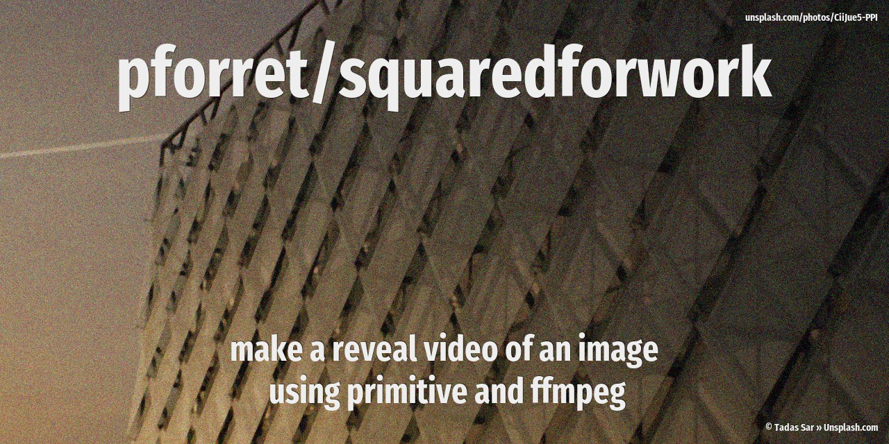

# squaredforwork

**create reveal movies for pictures with imagemagick, ffmpeg and primitive**



## Usage

```
Program: squaredforwork.sh 1.3.0 by peter@forret.com
Updated: Aug 27 18:23:37 2023
Usage: squaredforwork.sh [-h] [-q] [-v] [-f] [-1 <instagram>] [-2 <tiktok>] [-3 <facebook>] [-b <border>] [-c <credits>] [-e <extension>] [-l <log_dir>] [-m <method>] [-o <opening>] [-p <steps>] [-r <resize>] [-s <full_size>] [-t <tmp_dir>] [-i <img_dir>] [-j <out_dir>] [-x <prefix>] <action> <input …> <output …>
Flags, options and parameters:
-h|--help      : [flag] show usage [default: off]
-q|--quiet     : [flag] no output [default: off]
-v|--verbose   : [flag] output more [default: off]
-f|--force     : [flag] do not ask for confirmation (always yes) [default: off]
-1|--instagram <val>: [optn] export folder for instagram
-2|--tiktok <val>: [optn] export folder for tiktok
-3|--facebook <val>: [optn] export folder for facebook
-b|--border <val>: [optn] add border to original image  [default: 0]
-c|--credits <val>: [optn] credits to add at the end  [default: < Concept: @squaredforwork >]
-e|--extension <val>: [optn] output extension  [default: mp4]
-l|--log_dir <val>: [optn] folder for log files   [default: /Users/pforret/log/squaredforwork]
-m|--method <val>: [optn] primitive method  [default: 7]
-o|--opening <val>: [optn] opening text  [default: Guess the movie?]
-p|--steps <val>: [optn] steps done by primitive  [default: 600]
-r|--resize <val>: [optn] resize WxH  [default: 120x180]
-s|--full_size <val>: [optn] pixels longest side  [default: 1200]
-t|--tmp_dir <val>: [optn] folder for temp files  [default: .tmp]
-i|--img_dir <val>: [optn] folder for poster images  [default: image]
-j|--out_dir <val>: [optn] folder for output movies  [default: output]
-x|--prefix <val>: [optn] prefix for output files  [default: sfw]
<action>  : [parameter] action to perform: image/imdb
<input>   : [parameters] input image/film name (1 or more)
<output>  : [parameters] output file or '-' for automatic filename (1 or more)
```

## Examples

These are some low-res GIF versions of the end result:

Full size (800x1200):


Half size (400x600): 


And an actual video can be viewed here: [The Help (5MB .m4v)](assets/thehelp.m4v)
